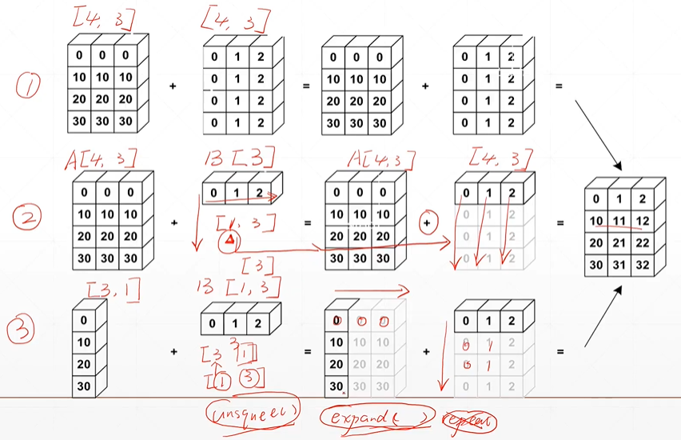
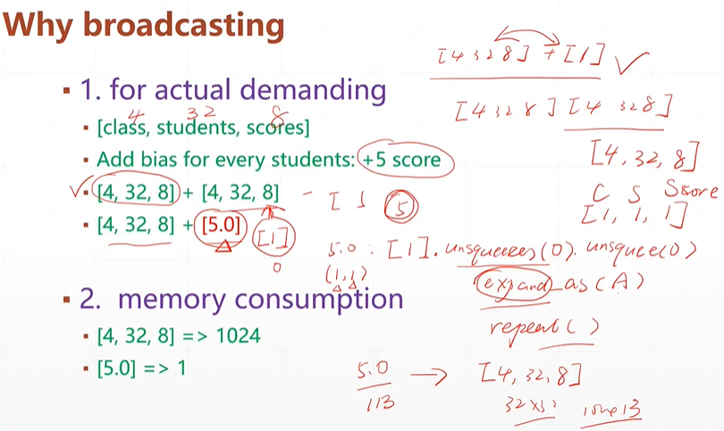
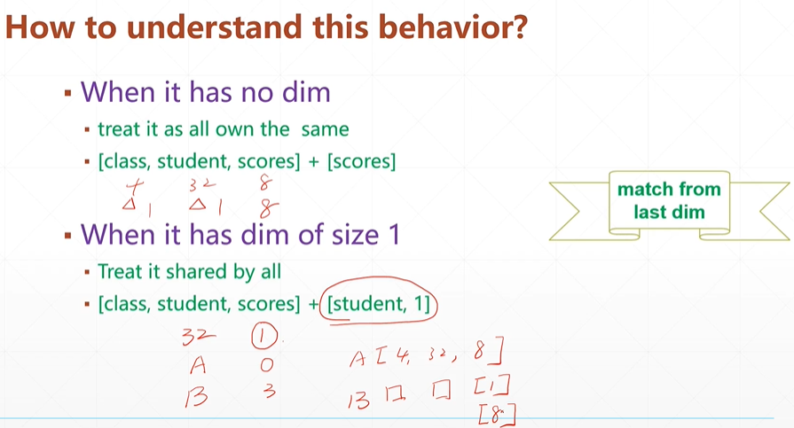

# Broadcast 广播（自动扩展）

### 要点

1.  在前面插入一个维度（在高纬度插入1）
2.  把大小是1的维度扩张成同样的维度

```python
Feature maps:[4, 32, 14, 14]  # 维度：大<------>小
Bias:[32, 1, 1] => [1, 32, 1, 1] => [4, 32, 14, 14] 
                    # 插入维度         扩张成同样大小
```







从最小的维度开始，大者大差不差，小者各有不同
