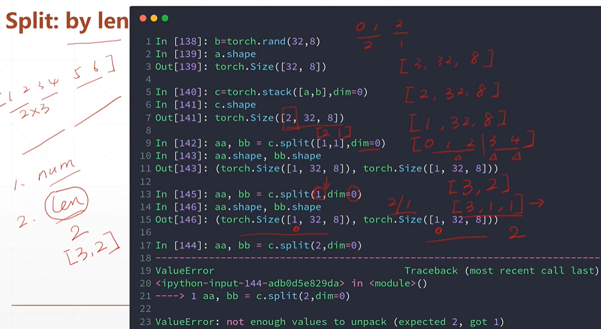

# 合并与分割

### cat：dimension相同

```python
a = torch.rand(4, 32, 8)
b = torch.rand(5, 32, 8)
torch.cat([a, b], dim=0).shape   torch.Size([9, 32, 8])
# 第一个参数选要合并向量，第二个参数选要合并的维度
```


### stack：会创建一个新的维度，相当于再分组


### split：根据长度来拆分



列表参数：分组的每组数量

int参数：每一组数量，自动分组

### &#x20;chunk：根据数量来拆分


int参数，拆分成几组，自动成组
