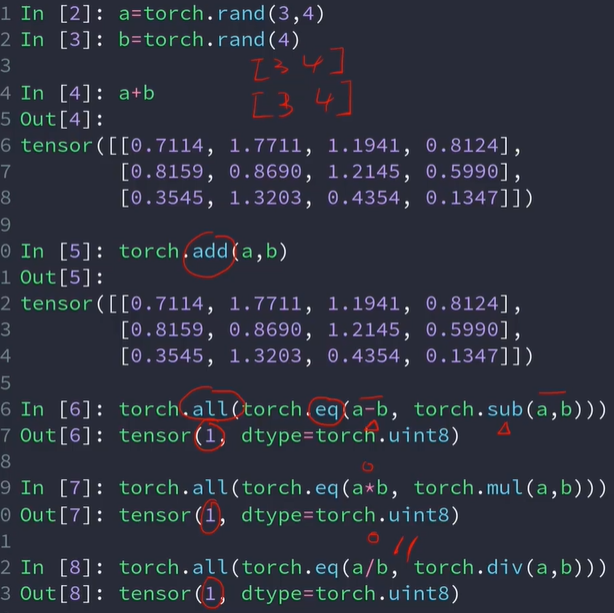
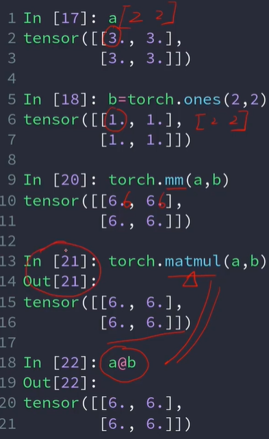
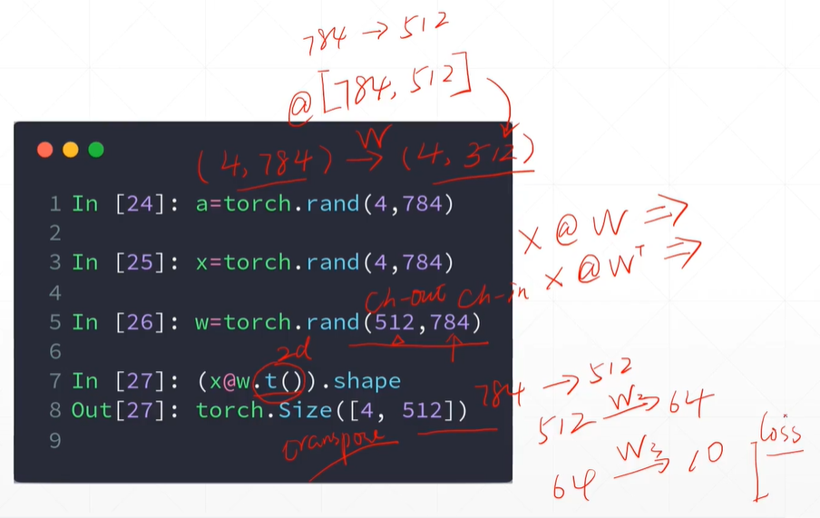
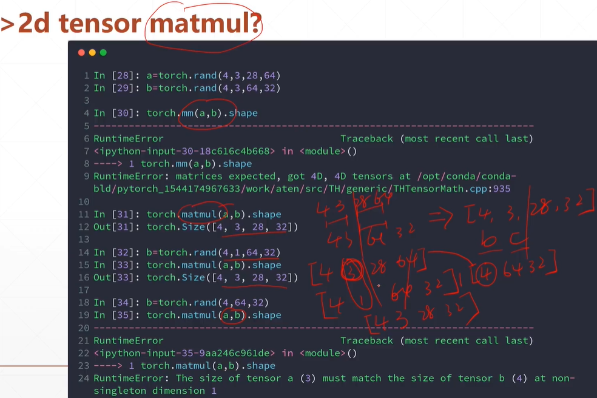
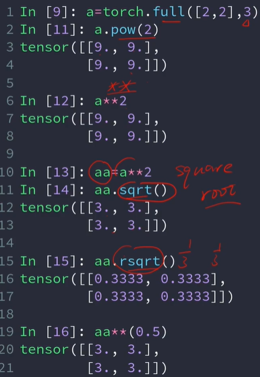
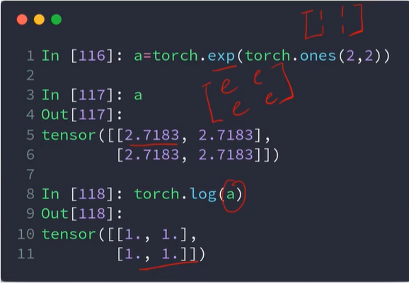
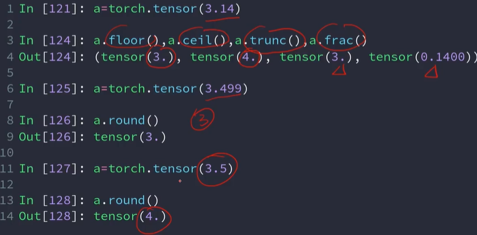
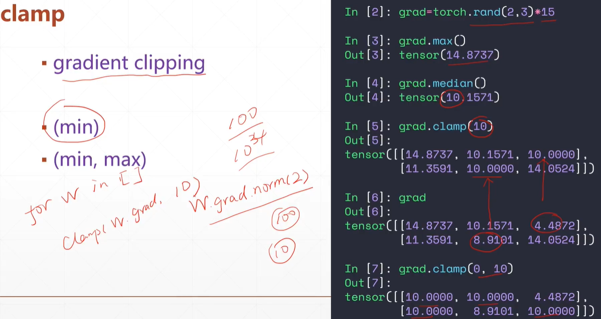

# 基本运算

pytorch已经进行了运算符重载

三种乘法效果一致，但只适合于2d

pytorch默认0是ch-out，1是ch-in，所以后面用转置，转置只能用于2d的矩阵

14-16行触发了broadcast机制，同时乘法只会对最后进行矩阵相乘运算，前面的维度保持不变

平方

exp log

取整

clamp 裁剪，对张量每个元素进行限制，min和max设置范围下限和上限

梯度的模w\.grad.norm(2)一般要小于10比较好，防止梯度爆炸

5里小于10的被替换为10，7里小于0的被替换成0，大于10的被替换成10

