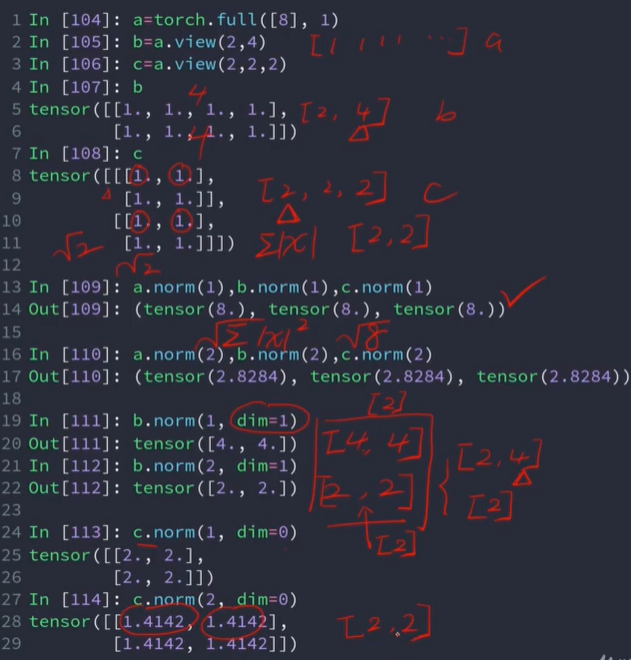
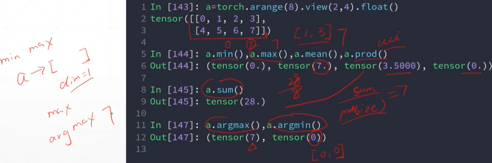
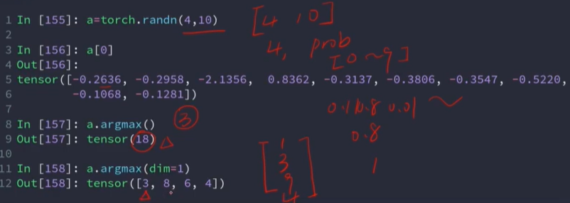
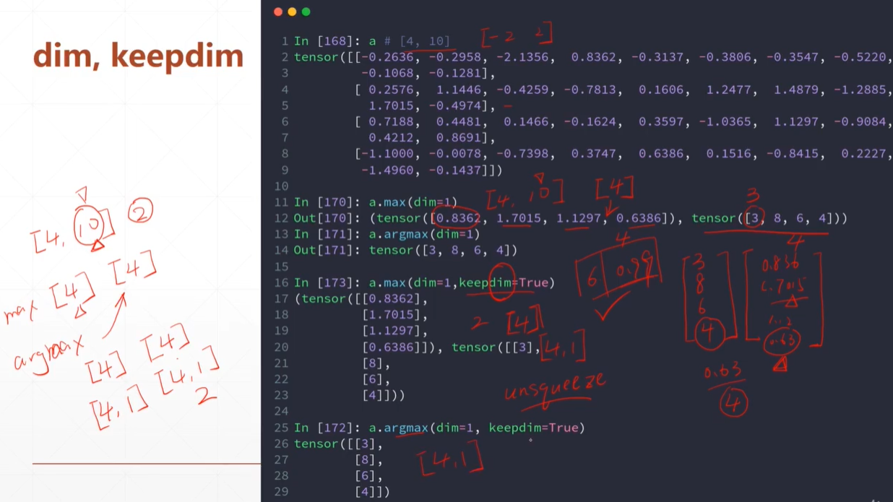
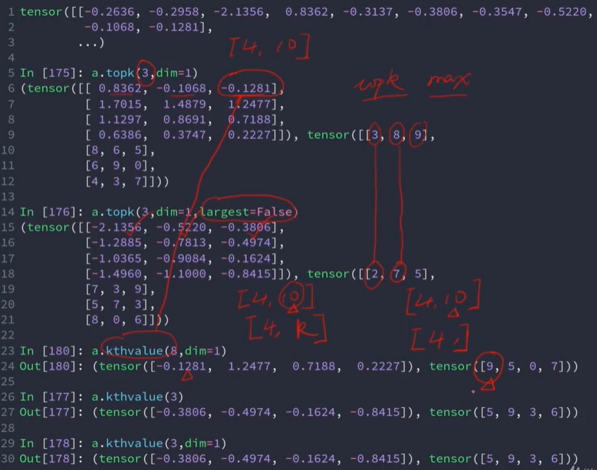
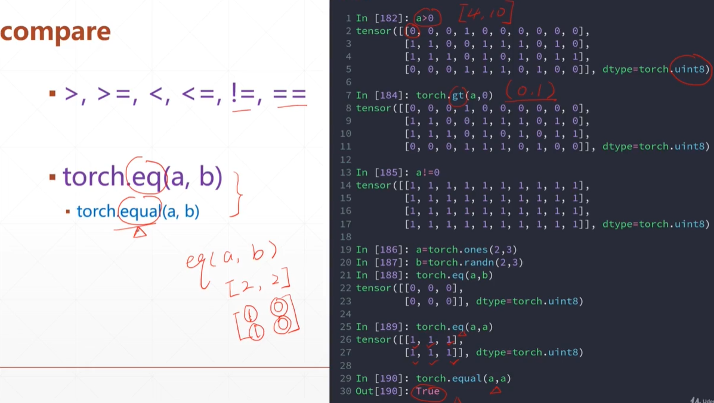

# 统计属性

### norm 范数

### mean, sum, min, max, prod（累乘）

min，max会先把矩阵打平，然后求最小最大值

argmin, argmax返回的是打平后最小值和最大值的索引，除非指定dim

### dim, keepdim

### topk, k-th

largest=False求最小

eq返回是否相等的矩阵，equal返回true或者false

